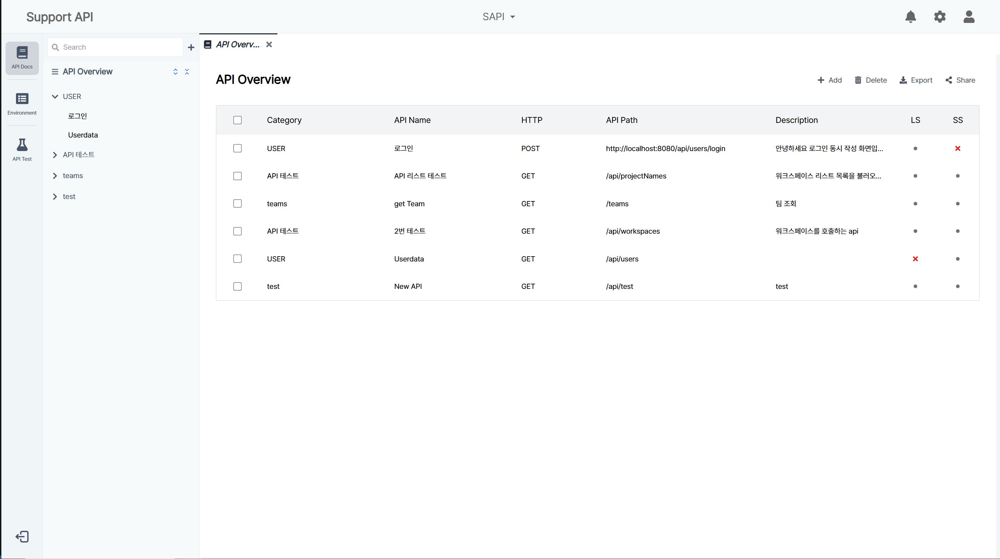
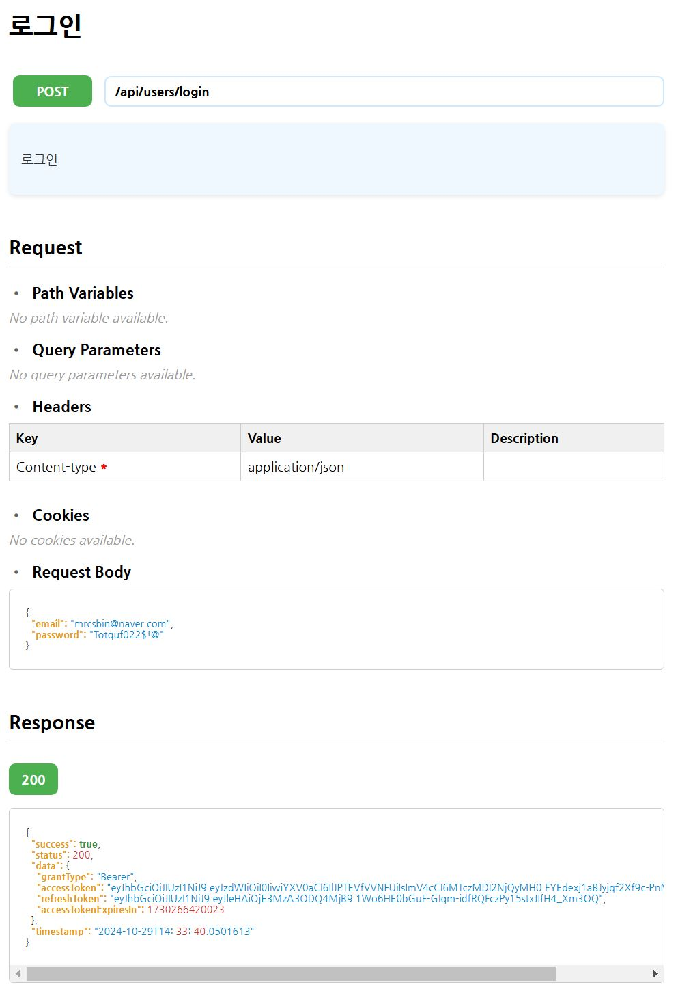
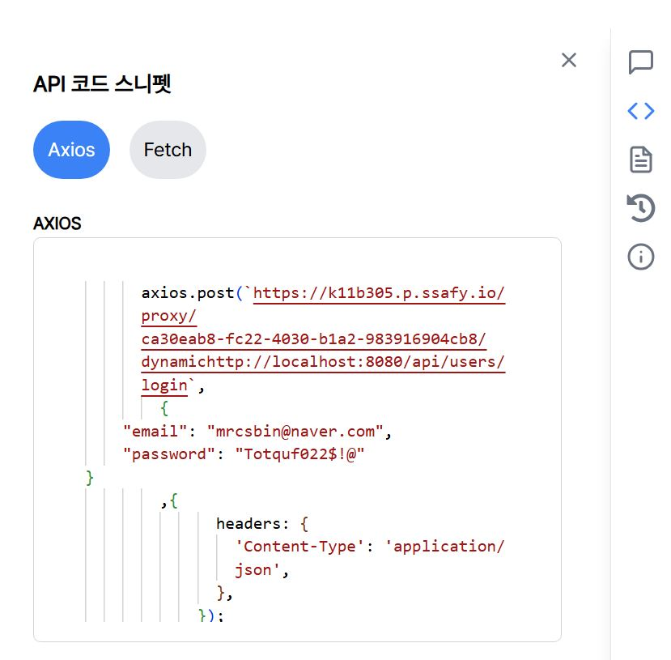
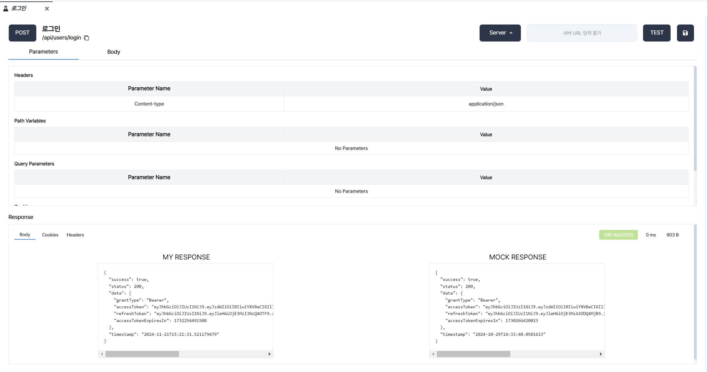
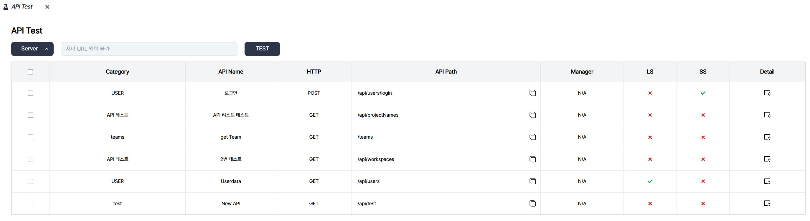
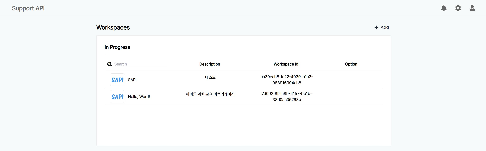
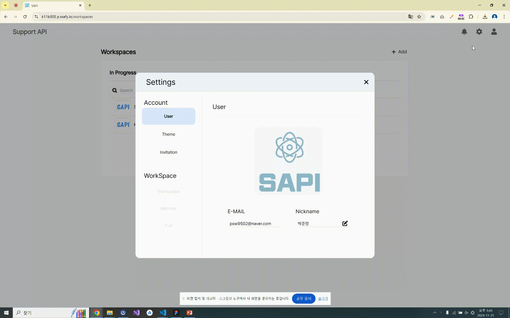
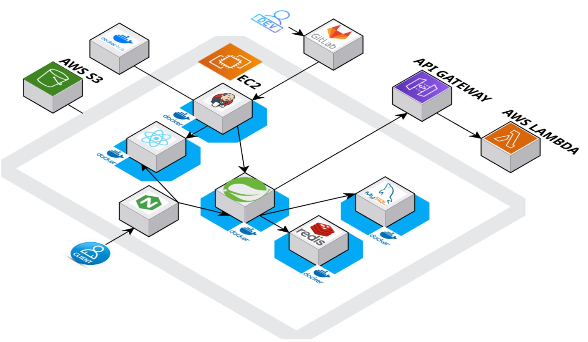
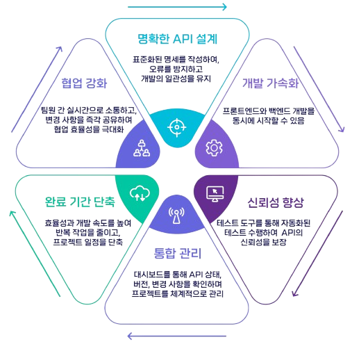

# SAPI
<h1 align="center">
  

  
개발자를 위한 API 통합 관리 시스템

</h1>

# :one: 프로젝트 개요

## 1. 개발 기간

| 개발기간 | 24.10.14 ~ 24.11.19 |
| --- | --- |

## 2. 구성 팀

| 팀원 | 역할 | 세부 내용 | 
| --- | --- | --- |
| 강세현 | Infra, Back-End Developer | BE, DB, Infra |
| 김문희 | Front-End Developer | FE, 디자인 |
| 박준영 | Front-End Developer | FE, 디자인, Web Socket |
| 박찬호 | Infra, Back-End Developer | Leader, BE, Infra, DB |
| 박용빈 | Back-End Developer | BE, DB, AWS Lambda Server |
| 조성빈 | Front-End Developer | FE, 디자인, Web Socket |

## 3. 기획 의도 및 목표
API 명세와 백엔드/프론트엔드 개발의 협업 과정에서 API 명세가 자주 변경되거나, 백엔드 개발이 완료되지 않은 상황 등 개발 과정에는 여러 문제들이 발생할 수 있습니다.

이 과정에서 API 명세가 복잡해지거나 변경사항이 제대로 반영되어있지 않다면 협업 효율이 저하되며, 개발 일정 지연과 품질 저하로 이어질 수 있습니다.

따라서, 개발의 속도를 높이고 팀 간 커뮤니케이션 문제를 최소화하며, 명세와 구현의 불일치를 사전에 방지하고자 AWS Rambda Server를 이용한 Mock API 구현 및 자동화된 API 검증 시스템을 기획하였습니다.

:star: 목표
| No | Content | 세부 내용 | 
| --- | -------------------- | ----- |
| 1 | API 명세서를 중심으로 팀 간 협업 강화 | 실시간 문서 동시 작성, API 문서화 |
| 2 | 자동화 테스트 및 Mock API 서버 제공 | Mock API 테스트 환경 구축, 테스트 자동화 |
| 3 | 명세서 관리 및 관리 시각화 | 개발 진행 대시보드 |

   
   

# :two: 서비스 기능 소개

## 1. API Document
- API 문서화   
  : 작성된 API 문서는 Overview 화면에서 문서화
  

- 웹 기반 에디터 실시간 편집 기능   
  : 웹소켓으로 실시간 문서 작성 협업 기능 구현
  

- 명세 추출 (export 기능)   
  : 작성된 API 문서 마크다운 양식 Export 기능 구현
  

- 코드 스니펫
  : 작성된 API 문서 코드 스니펫(Axios, Fetch) 기능 구현
  

## 2. API Test
- API Test (Back-End 사용자 기준)   
  : 작성한 명세서 기반으로 Back Server에 API TEST 결과 산출   
  

- API Test (Front-End 사용자 기준)   
  : 작성한 코드를 기반으로 Back Server 없이도 Mock API를 통해서 결과 FeedBack   
  
  
- API OverView
  : 테스트 완료된 데이터는 Overview에서 실시간 확인 및 분석 (LS : Local Status // SS : Server Status)
  

## 2. 추가 기능

- Workspace Interface
  : 개발 프로젝트 별 환경 구성
  

- Setting 환경 구성
  : User 정보 변경, Theme 설정, Invitation 기능 Alarm 기능
  

   
   

# :three: 기술 스택   

## Frontend
  - React
  - Tailwind CSS
  - HTML
  - JavaScript
  - ReactQuery
  - Zustand

## Backend
  - Java 17
  - SpringBoot 3
  - SpringSecurity
  - SSE
  - MySQL 8.0.23
  - Redis
  - Spring Data JPA
  - QueryDSL
  - AWS Lambda, S3
  - Thymeleaf

## Infra
  - AWS EC2
  - Docker
  - Docker Compose
  - Jenkins
  - NGINX
  - Ubuntu 20.04

   
   

# :four: 아키텍처   
    

   
   
  
# :five: 기대효과  
<h1 align="center">
  
</h1>
  

# :six: 
